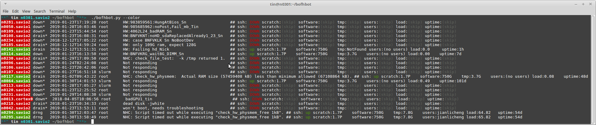

BofhBot
=======

An enhanced sinfo -R for lazy sys admins--aka bofh :)

BOFH is known to be a lazy slacker.
Laziness is a virtue.  which is why a bot is born to do the job for BOFH.
In this case, look at sinfo -R and help repair slurm nodes that are sick.

v1 classic cli
==============

This version, residing in the branch v1_classic_cli, 
providing an output for sys admin to analyze what's going on.
The automation here is just to do lots of ping, ssh, uptime and consolidate it in a wide table.

eg usagee:

module load python/3.6
./bofhbot.py | tee bofhbot.brc.2018.1001.txt

./bofhbot.py -ddd 
./bofhbot.py --ipmi -v 
./bofhbot.py -vv -ddd --nodelist ./dev_aid/nodelist

./bofhbot.py -ddddd -s ./dev_aid/sample_input/sinfo-RSE.test.txt

/global/software/sl-7.x86_64/modules/langs/python/3.6/bin/python3   bofhbot.py | tee bofhbot.brc.2018.1001.txt

bofhbot "v1.1"
==============

As of 2021.0505
the stable/regular use of bofhbot.py, is actually in 
branch rest_draft_plan fd22ec4 tagged as v1.1_regUseBofhbot

