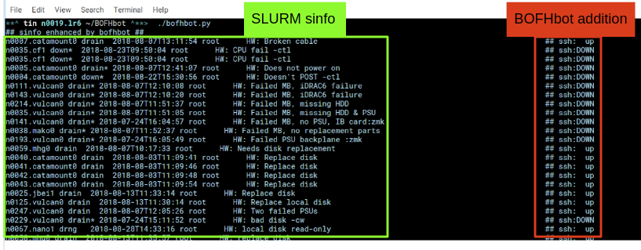

BofhBot
=======

An enhanced sinfo -R for lazy sys admins--aka bofh :)

BOFH is known to be a lazy slacker.
Laziness is a virtue.  which is why a bot is born to do the job for BOFH.
In this case, look at sinfo -R and help repair slurm nodes that are sick.
At first it would just help with some of the initial troubleshooting manial work, 
such as see if node:

- is pingable
- can be ssh to
- nhc report status
- some manual mount and checks not corrently configured in nhc cuz of histerical reason
- ipmi reachability (eg can ipmi power status/cycle) revive the node
- slurm pid 
- node status (presumably no running job on the node)
- recommended action
- confidence of recommendation

Example output
--------------

::

	sinfo -R -S %E --format="%9u %19H %6t %N %E"    				# + extra columns

	USER      TIMESTAMP           STATE  NODELIST REASON				# fixid ping  ssh nhc slurm-pid ipmi-powerstatus recommendation  confidence
	Node unexpectedly re root      2018-07-31T20:06:16 n0181.savio2			  hash1 ok    ok  ok  nnnn      on               scontrol... state=resume 80%

	### this last one would benefit from historical record of how many times node upped to avoid getting stuck in a loop.

	root      2018-08-11T10:22:31 down*  n0152.savio1 Not responding                # hashB no    no  na  na        on               ipmi cycle 99%
	root      2018-07-24T09:38:02 down*  n0165.savio1 Not responding                # hashC ok    cant login na     not responding   wwsh ipmi cycle  80%

	root      2018-05-21T10:20:52 down*  n0030.savio1 HW. Tin. need open case.   wont power on, even after reseating blade
	root      2018-06-26T10:08:33 down*  n0107.savio2 HW.ReseatedManyTime_WontPowerOn.Tin
	root      2018-05-21T10:48:18 down*  n0000.savio2 HW: Tin. check console/bios boot settings.  when boot again check hw health/wonkiness
	root      2018-05-21T11:20:32 drain* n0096.savio2 HW: need HT off. Tin
	root      2018-06-26T10:50:56 down*  n0114.savio2 HW:54gRAMonly
	root      2018-07-30T15:57:35 drain* n0133.savio1 HW:replace sda,io err-Sn
	root      2018-07-30T12:26:45 drain* n0108.savio2 HW:sda missing after reseat-Sn
	root      2018-06-26T10:44:57 down*  n0113.savio2 HW:shutdownAgainWontPowerOn_openCase
	root      2018-05-11T14:44:33 down   n0166.savio2 INC0661212_nick
	root      2018-07-26T15:53:16 drain  n0124.savio2 NHC: check_fs_mount:  /global/scratch not mounted
	root      2018-07-26T15:53:16 drain  n0117.savio2 NHC: check_hw_physmem:  Actual RAM size (57459408 kB) less than minimum allowed (67108864 kB).
	root      2018-04-06T13:04:50 down*  n0234.savio2 NoBootDev_Tin
	root      2018-03-15T18:37:30 drain  n0182.savio2 NoIB_Tin 

	root      2018-08-06T07:47:26 down*  n0035.savio2,
	n0087.savio2,
	n0091.savio2 Not responding

TL;DR
=====

Future output possibilities
---------------------------

append several columns to it:

:: 

	ping  ssh   nhc   slurm-pid  ipmi-powerStatus   recommed-action
	ok    no    na    na         on/time-out        wwsh ipmi cycle

output as quickly as node responses are gathered.
probably avoid ncurses/top interface, so easier to capture output to file.

each row add an index number? short hash?
so that future can do --fixit option to such record?

this for now don't have a database of recommended actions.
but still allow for cron every few hours to see its recommended action.

add an action confidence% :)

colored output maybe nice.
future default to --color
best if output to console and TERM support color, automatically do it.
But if redirecting or piping, then color is off automagically.
If too much work, start with just supporting --color to explicitly trigger coloring of output
(think of ls and grep)

other names
-----------

slurmbot
sinfobot
hpcbot?
bofhbot - yeah, i like this!

Motivation
----------

a bot that fixes slurm problem reported by sinfo -R
(and possibly other source of complains).

some problems should be fairly non-harmful to fix.

	- resume node.
	- login to node, do a few sanity check.
		- nhc
		- expected mounts (esp those not checked by nhc)
		- df /global/software
		- ibstat
		- df /global/scratch
	- if pass check, can resume.

Infrastructure:

  - history check for each node.
	- if repeatedly needing same fix, say within last 24 hours.  then get sys admin help
	- this also allow for query history of repair of each node
	  bofh node=n0000.testbed history...
	  something after wwsh :)

  - state machine of each node's health
	* to help determine if reboot, etc action would impact user.
	- similar to nhc?
		- checked ib
		- checked eth
	- any job running on the node?  (squeue -p PART | grep node; more direct way to query?)
	

- history of (recommended/emailed) fixes:
  email report at first with recomended action for sys admin
  exact cmd for cut-n-paste (prefixed with sudo when needed)
  email cannot nag.  send out only once
 	- setting to remember 4 days? 7 days?
		- do not nag about a problem if reported before 
		- reminder of old problems if not fixed after X remembered days?
	- command to clear out all alerts
  	- command to reduce "remembered" days, ie, if change remember from 4 to 3 days, would trim db records for anything older than 3 days.  (is this really needed?)
	- commands to re-list all pending fix recommendations on demand
		- for last 1, 2, 3 days.

EXAMPLE cmd
-----------

bofhbot -R
	a better output than sinfo -R
    add basic troublshoot info as extra columns as defined above

bofhbot --list
	show more extensive problem.  eg, 
		NHC: check_fs_mount:
	becomes
		/tmp not mounted.  sda missing.
	but nhc may have the info?
	or need more extensive config than nhc?
		no, can look at fstab, just do things sys admin would do...

	show recommended actions from its history db
  

Low hanging fruits
------------------

example of sinfo -R that are easy to fix:

Node unexpectedly re slurm     2017-11-21T09:23:16 n0012.etna0,n0016.etna0,n0017.etna0
        scontrol update node=... state=resume

batch job complete f root      2018-07-22T15:10:04 n0032.savio2
        scontrol update node=n0032.savio2 state=resume

Not responding       root      2018-07-24T10:48:02 n0283.savio2
	if not pingable (param to set CanRelyOnPing=True)
	not ssh-able
	can then ipmi power cycle the node
	NodeBootWaitTime=180 (seconds)
	beyond this, email sys admin and ask for manual intervention.

~~~~

Division of labors
==================

- cli parser
- case statement of all sinfo -R message and dispatch what module to call
- function for each kind of check:
    - nodePingable()
    - nodeSshable()
    - nodeIpmiable()
- node status health state machine
    - maybe needed before can create a recommended fix action
    - confidence level.  should actually start out small, not very confident :)
- history of recommended actions db (as sqlite db file?  in a high level $HOME/.bofhbot/ dir??)
-  

Branches
========

Don't know... I suppose should have a dev branch that is less stable than master...

License
=======
BSD 3-clause, as indicated in the github license choice for this project.

