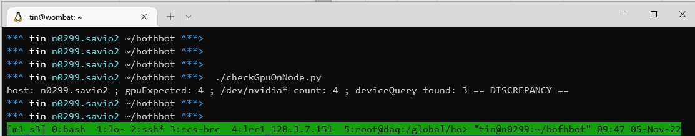
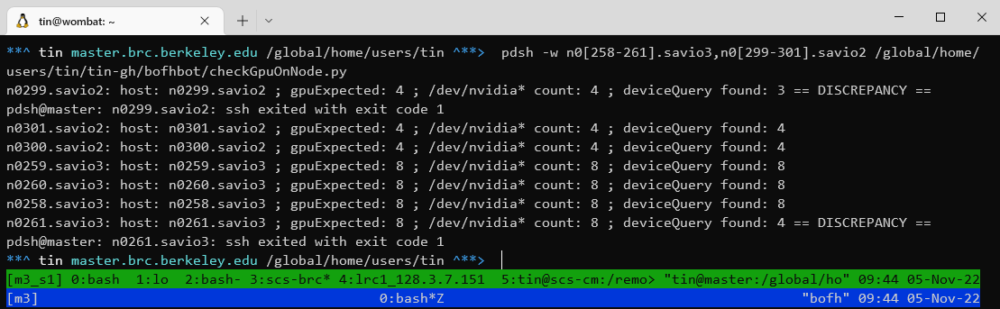

checkGpu.py when run locally on a gpu node:

checkGpu.py when run via pdsh on several nodes in parallel:

BofhBot
=======

The checkGpu branch is mostly for a single script:

`checkGpu.py`

which detect if any gpu is problematic and offline,
thereby needing intervention to bring gpu back online.
BOFH style: reboot the node, which fixes 80% of the cases :D

